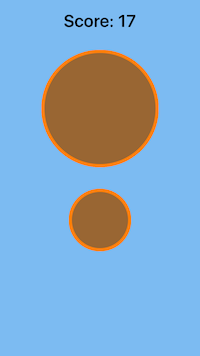

# Intermediate iOS Design Patterns

This is an intermediate level exercise to learn some common uses of Design Patterns in iOS thru example of building an app. The app is a simple game that generates a couple of images for users to choose the largest one from to gain a point to their score. The score decrements for wrong selections and bonus points are added for streaks of correct selections. 

I have made a few modifications, namely switching most classes to value types, structs, and switching out the use of tuples for passing around shape pairs to using arrays of shapes as I am thinking of adding ability to randomly generate multiple shapes, more than just two, for any given turn. Also made the shapes a little more generic by renaming the square's sideLength and circle's diameter to areaFactor for both with the idea to end up with one shape object type and inject the area calculation as needed.

##Covers examples for the following patterns:

  * Abstract Factory
  * Servant
  * Builder
  * Dependency Injection
  * Strategy
  * Chain of Responsibility
  * Command 
  * Iterator

##Abstracts for demonstrated patterns:
###Abstract Factory
The idea here is to eliminate hard-coded class dependancies by establishing an API for creating related objects.

###Servant
Helps expose a behavior, in this case score calculation, to a group of interested classes.

###Builder
Used to make object configuration more flexible by separating configuration into a separate class from the given object(s).

###Dependency Injection
This is where you have a dependency that say needs a factory and designing it so you can inject different factory types as needed.

###Strategy
Used to generate a family of algorithms that are interchangeable at runtime. Here it is used to determine the use of circle or square for each turn.

###Chain of Responsibility
Captures the notion of dispatching multiple commands across a set of data. Allows the addition of streak scoring in addition to and without disrupting the base scoring process. Additional scoring methods can be added this way without effecting the others, so say you wanted to give a super bonus when/if user get 10, 20, 100, etc turns correct.

###Command
Is the concept of invoking specified behavior on a target when triggered.

###Iterator
You use this as a for ... in loop. Interface for navigating collections.

##This is from following the tutorial from Ray Wenderlich's site at:

###Intermediate Design Patterns In Swift:
http://www.raywenderlich.com/86053/intermediate-design-patterns-in-swift

Tested with Xcode 7.2, iOS 8, and running on iPhone 6s

Screenshots:

Main Screen: 
